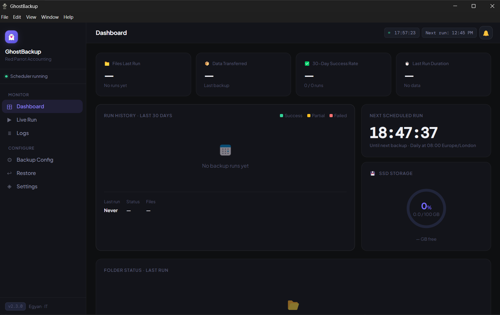
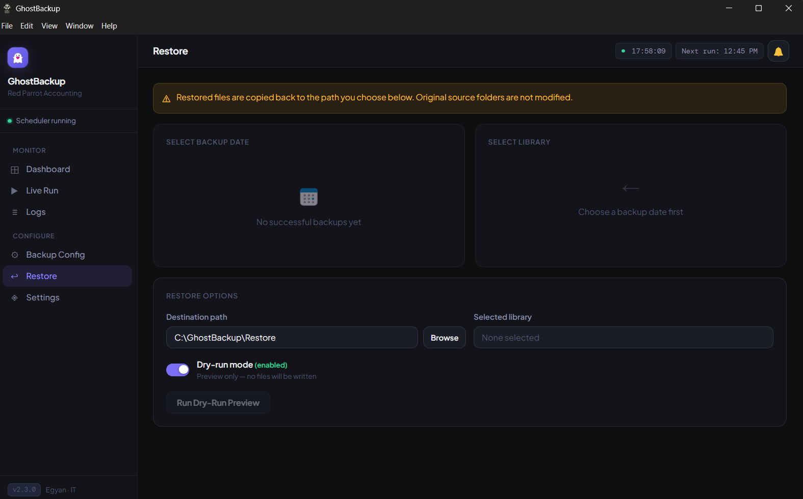

# 👻 GhostBackup

### Automated Backup with Encryption & Audit Logging


**Author: [Egyan07](https://github.com/Egyan07)**

GhostBackup is a secure automated backup system built with **Electron, React, and Python FastAPI**. Originally built for and actively deployed at Red Parrot Accounting (UK) — open source and free for any small business to use.

> **Platform:** Windows (fully supported). macOS and Linux are not officially supported — the app may not install or run correctly on those platforms.

---

## 📑 Table of Contents

- [Screenshots](#-screenshots)
- [Tech Stack](#-tech-stack)
- [Features](#-features)
- [Quick Start](#-quick-start)
- [Testing](#-testing)
- [Architecture](#-architecture)
- [API Endpoints](#-api-endpoints)
- [Configuration](#-configuration)
- [Environment Variables](#-environment-variables)
- [Project Structure](#-project-structure)
- [Security](#-security)
- [Retention & Audit](#-retention--audit)
- [Troubleshooting](#-troubleshooting)
- [Contributing](#-contributing)
- [Use Cases](#-use-cases)
- [License](#-license)
- [Changelog](#-changelog)

---

## 📸 Screenshots

| Dashboard | Live Run | Restore |
|-----------|----------|---------|
|  |  |  |

| Email Alert |
|-------------|
|  |

---

## 🧰 Tech Stack


---

## ✨ Features

| Feature | Description |
|---------|-------------|
| 🔐 Encryption at Rest | AES-256-GCM streaming encryption (constant memory usage) |
| 🔒 API Security | Auto-generated session API tokens per launch |
| 📜 Retention & Audit | Configurable retention periods with guard-day protection |
| 💾 Dual-SSD Redundancy | Primary and secondary SSD with physical rotation support |
| ⏰ Scheduled Backups | Daily automated backups with configurable time + timezone |
| 👁️ Real-Time File Watching | Monitors source folders and triggers incremental backup on changes (15s debounce, 120s cooldown) |
| 🛑 Failure Threshold Abort | Aborts a library if >5% of files fail (minimum 3 failures) — other libraries continue |
| ✅ Integrity Verification | `/verify` endpoint re-hashes all backed-up files |
| 📚 Audit Trail | All configuration changes logged with timestamps |
| 📧 Email Alerts | SMTP failure alerts and run summaries |

---

## 🚀 Quick Start

**Windows setup:**

**Prerequisites:** [Python 3.10+](https://www.python.org/downloads/) (add to PATH during install) and [Node.js 18+](https://nodejs.org/)

1. Clone the repository
2. Double-click **`install.bat`** — creates virtualenv, installs dependencies, runs setup wizard
3. Follow the prompts — SSD path, source folders, and encryption key are configured interactively
4. Double-click **`start.bat`** to launch (recreate with `install.bat` if missing)

> **Note:** Admin privileges are not required. Expected install time: 2–5 minutes depending on network speed.

> Full step-by-step instructions in **[SETUP.md](SETUP.md)**.

---

## 🧪 Testing

```bash
# Backend (278 tests, 82% coverage)
cd backend
python -m pytest tests/ -v --cov=. --cov-report=term-missing

# Frontend (60 tests)
npm test
```

---

## 🏗 Architecture

```
┌─────────────────────────────────────────────────────────────┐
│ ELECTRON                                                    │
│ • Generates API token (crypto.randomBytes)                  │
│ • Spawns Python backend process                             │
└──────────────────────────┬──────────────────────────────────┘
                           ▼
┌─────────────────────────────────────────────────────────────┐
│ FASTAPI BACKEND (default port 8765)                         │
│                                                             │
│ 🔒 Authentication Middleware                                │
│ Requires X-API-Key header for all endpoints except /health  │
│                                                             │
│ ⏰ Scheduler         👁️ File Watcher                        │
│                                                             │
│ Backup Engine                                               │
│  ├─ 🔐 Encrypt files (AES-256-GCM streaming)                │
│  ├─ 💾 Copy to primary and secondary drives                 │
│  ├─ ✅ Verify integrity using xxhash                        │
│  └─ 📚 Log results to SQLite                                │
└─────────────────────────────────────────────────────────────┘
                           ▲
┌──────────────────────────┴──────────────────────────────────┐
│ REACT FRONTEND                                              │
│ • Dashboard  • Live Run  • Logs                             │
│ • Restore    • Settings  • Alert Bell                       │
└─────────────────────────────────────────────────────────────┘
```

---

## 🔌 API Endpoints

All endpoints require the **X-API-Key header** except `/health`.

| Method | Endpoint | Description |
|--------|----------|-------------|
| GET | /health | Health check (no auth required) |
| GET | /dashboard | Dashboard summary stats |
| GET | /run/status | Active run state |
| POST | /run/start | Start backup |
| POST | /run/stop | Cancel running backup |
| POST | /verify | Verify backup integrity |
| GET | /runs | Backup history |
| GET | /runs/:id | Single run detail |
| GET | /runs/:id/logs | Run log entries |
| POST | /restore | Restore files |
| GET | /config | Current configuration |
| PATCH | /config | Update configuration |
| GET | /config/audit | Configuration audit trail |
| POST | /config/sites | Add backup source folder |
| PATCH | /config/sites/:name | Update source folder |
| DELETE | /config/sites/:name | Remove source folder |
| GET | /ssd/status | SSD health and disk usage |
| GET | /alerts | In-app alert list |
| POST | /alerts/:id/dismiss | Dismiss alert |
| POST | /alerts/dismiss-all | Dismiss all alerts |
| PATCH | /settings/smtp | Update SMTP settings |
| POST | /settings/smtp/test | Send test email |
| PATCH | /settings/retention | Update retention policy |
| POST | /settings/prune | Run prune job |
| POST | /settings/encryption/generate-key | Generate new encryption key |
| GET | /watcher/status | File watcher status |
| POST | /watcher/start | Start file watcher |
| POST | /watcher/stop | Stop file watcher |

---

## ⚙️ Configuration

Config file location: `backend/config/config.yaml`
Copy template from: `backend/config/config.yaml.example`

```yaml
ssd_path: "D:\\GhostBackup"
secondary_ssd_path: "E:\\GhostBackup2"   # optional

encryption:
  enabled: true   # requires GHOSTBACKUP_ENCRYPTION_KEY in .env.local

sources:
  - label: "Client Records"
    path: "C:\\Users\\admin\\SharePoint\\Red Parrot\\Clients"
    enabled: true

retention:
  daily_days: 365
  weekly_days: 2555
  compliance_years: 7
  guard_days: 7

schedule:
  time: "08:00"
  timezone: "Europe/London"

circuit_breaker_threshold: 0.05
```

---

## 🔑 Environment Variables

| Variable | Required | Description |
|----------|----------|-------------|
| `GHOSTBACKUP_ENCRYPTION_KEY` | Yes (if encryption enabled) | Base64-encoded Fernet key — HKDF-derived to 256-bit AES key. Generate via Settings → Encryption. |
| `GHOSTBACKUP_SMTP_PASSWORD` | Yes (if email alerts enabled) | SMTP password |
| `GHOSTBACKUP_API_PORT` | No (default: 8765) | API server port |
| `GHOSTBACKUP_API_TOKEN` | Auto | Generated by Electron on each launch |

Store secrets in `.env.local` — never commit this file.

---

## 📂 Project Structure

```
GhostBackup/
│
├── install.bat              ← run this first on a new machine
│
├── backend/
│   ├── config/
│   │   ├── config.yaml.example
│   │   └── config.yaml
│   ├── api.py               ← FastAPI server (default port 8765)
│   ├── config.py            ← ConfigManager
│   ├── manifest.py          ← SQLite run/file/audit database
│   ├── reporter.py          ← AlertManager + SMTP email
│   ├── scheduler.py         ← APScheduler daily job + watchdog
│   ├── setup_helper.py      ← called by install.bat
│   ├── syncer.py            ← file scan, encrypt, copy, verify, prune
│   ├── utils.py             ← shared fmt_bytes / fmt_duration helpers
│   ├── watcher.py           ← watchdog real-time file watcher
│   └── tests/               ← 278 pytest tests
│
├── electron/
│   ├── main.js              ← main process, spawns backend, tray
│   └── preload.js           ← contextBridge API surface
│
├── src/
│   ├── GhostBackup.jsx      ← app shell + navigation
│   ├── main.jsx             ← React entry point + backend poller
│   ├── api-client.js        ← authenticated fetch wrapper
│   ├── styles.css           ← all app styles
│   ├── splash.css           ← splash screen styles
│   ├── components/          ← reusable UI components
│   ├── pages/               ← full-page views
│   └── tests/               ← 60 vitest tests
│
├── screenshots/             ← README screenshots
├── SETUP.md                 ← full setup guide
└── CHANGELOG.md             ← full version history
```

---

## 🔐 Security

| Layer | Implementation |
|-------|----------------|
| Encryption | AES-256-GCM streaming with version header (key rotation ready) |
| API Authentication | Timing-safe session tokens (`hmac.compare_digest`) |
| Path Safety | Path traversal validation on restore endpoint |
| Electron Sandbox | Chromium sandbox enabled, CSP in dev + production |
| Credential Safety | Input sanitization on credential writes to `.env.local` |
| Database Safety | SQLite with `PRAGMA synchronous=FULL`, batched commits |
| Process Safety | Process name verification before port conflict termination |
| Data Integrity | xxhash verification after every copy |
| Failure Control | Circuit breaker at 5% file failure threshold |

---

## 📜 Retention & Audit

> **Disclaimer:** GhostBackup provides configurable retention and audit logging that can support compliance workflows, but does not itself constitute legal compliance. Consult a legal professional for GDPR, UK Companies Act, or other regulatory requirements specific to your business.

| Feature | Detail |
|---------|--------|
| Daily retention | 365 days (configurable) |
| Weekly retention | 2555 days / 7 years (configurable) |
| Guard days | 7 days — prevents accidental pruning of recent backups |
| Audit trail | All config changes logged with UTC timestamp + hostname |
| Integrity check | `/verify` endpoint re-hashes all backup files on demand |

---

## ⚠️ Limitations

- **No offsite backup**: both SSDs are local. Pair with physical drive rotation for disaster recovery.
- **Files only, not OS images**: restores individual files/folders. For full system recovery, pair with a disk imaging tool (e.g. Macrium Reflect Free).
- **Locked files**: files held open by other processes (e.g. open Excel sheets) are retried but may still be skipped. Check logs after each run.
- **Windows long paths**: paths over 260 characters may fail unless long path support is enabled in Windows (`HKLM\SYSTEM\CurrentControlSet\Control\FileSystem\LongPathsEnabled = 1`).
- **Single machine**: the scheduler, watcher, and dashboard all run on one machine. If that machine is offline, no backup runs.
- **Scale**: tested up to ~50GB source data. Performance on very large datasets (500GB+) is untested.
- **No bare-metal restore test**: always verify you can restore from backups before relying on them in production. Run `/verify` regularly.

---

## 🛠 Troubleshooting

**Q: I get "port already in use" every time I open the app.**

**A:** You closed the app with the X button, which hides it to tray — it was still running in the background. Always quit via File → Exit or right-click the tray icon → Quit GhostBackup. This fully exits and releases port 8765.

**Q: The splash screen shows "backup service stopped unexpectedly (exit code 1)".**

**A:** Your Python dependencies are out of sync. Run:
```
pip install -r backend/requirements.txt
```
Then relaunch via `start.bat`.

**Q: Email alerts aren't arriving.**

**A:** Make sure you're using a Gmail App Password, not your regular Gmail password. Generate one at `https://myaccount.google.com/apppasswords`. In Settings, set SMTP host to `smtp.gmail.com`, port `587`, enter your Gmail address in both From and Recipients, save — then click Send Test Email to verify.

**Q: The backup isn't running at the scheduled time.**

**A:** Check the green dot in the sidebar — if it's grey or red, the scheduler isn't running (restart the app). Also verify `schedule.time` and `schedule.timezone` in `config.yaml` are correct for your timezone.

---

## 🤝 Contributing

This project is built for internal use at Red Parrot Accounting. Issues and pull requests are welcome for bug fixes and improvements.

1. Fork the repository
2. Create a feature branch (`git checkout -b fix/your-fix`)
3. Run tests before submitting (`pytest backend/tests/` and `npm test`)
4. Open a pull request with a clear description

---

## 💼 Use Cases

- Accounting firms (UK Companies Act 2006 compliance)
- Legal offices
- Financial services
- Medical record systems
- Any business requiring encrypted, auditable, scheduled local backups

---

## 📄 License

MIT License

---

## 📋 Changelog

Full version history available in **[CHANGELOG.md](CHANGELOG.md)**.

---

*👻 GhostBackup — Silent. Secure. Compliant.*
